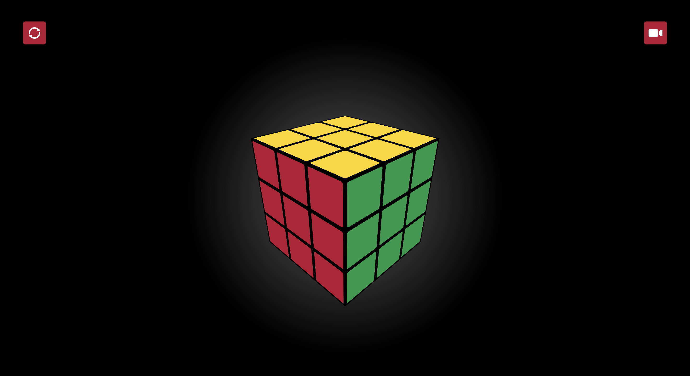

# CSS only Rubik's Cube

# Challenge
My challenge was to create a 3D working Rubik's cube with the following conditions:
- No JavaScript
- No CSS pre- or post-processors
- No classes & id's (exception for associating labels with inputs)

# To do's
- Allow multiple turn interactions in different directions
- 1 Big psycho mode on each side instead of on all 9 blocks
