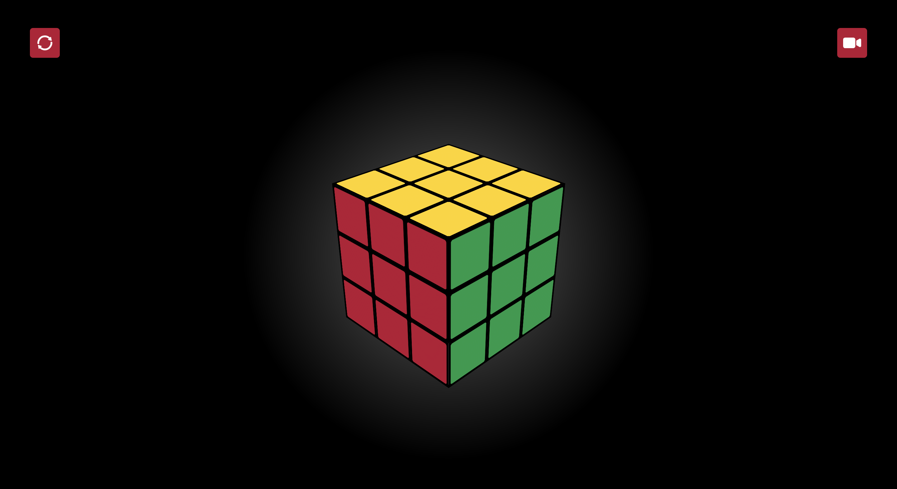

# CSS only Rubik's Cube

# Challenge
I tried creating a 3D working Rubik's cube without:
- JavaScript
- CSS pre- or post-processors
- Classes & id's (exception for associating labels with inputs)

# To do's
- Allow more turn interactions
- 1 Big psycho mode for each side instead of on all 9 blocks
